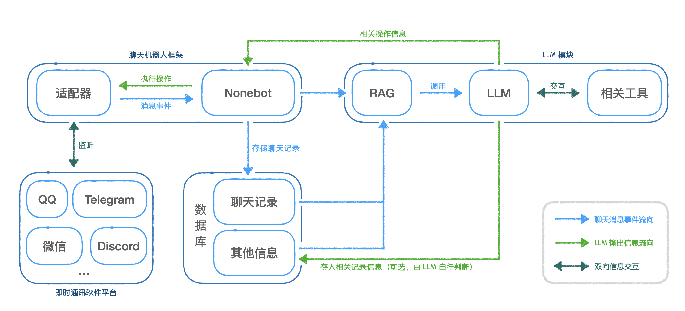

# 🚧 CyberFriend: 你的赛博群友🤖
这是一个由大语言模型 (LLM) 技术驱动的，一个模仿现代人类互联网聊天风格的机器人。它同时会使用群管理工具、互联网搜索引擎、带有记忆（本地向量数据库），为各种聊天群聊提供广泛的功能、活跃群内气氛。

技术上，项目使用 Nonebot 作为机器人交互框架，通过使用各种聊天协议适配器，从而实现支持任何聊天平台（如 QQ、Telegram 等等）；目前使用 ChatGLM3 作为 LLM 模型，通过收集群内聊天记录来微调模型，可以实现模拟真实群友的功能。

[代码结构和说明](resources/code_structure.md)

项目架构图：

目前正在开发阶段，初步效果非常炸裂，欢迎加入我们！

## 功能规划

1. **基础对话引擎**：
   - **核心对话处理**：使用大型语言模型（LLM）为基础，创建能够处理日常对话的AI。
   - **上下文理解**：在对话中保持上下文的连贯性，保存聊天记录。

2. **个性化与适应性**：
   - **用户行为分析**：分析群内的对话内容和风格，更适应每个群。
   - **持续学习**：根据大量的聊天记录进行微调，能够更像真人。
   - **RAG**：拥有“群聊知识库”，可以进行群聊私域的记录和检索。🚧
   - **模拟机制**：能够模拟单独的某个人的语气。🚧
   - **调用群聊操作**：能够调用群聊相关操作，例如撤回、退群、禁言等等。🚧
   - **调用工具**：能够调用相关工具，例如搜索、绘图等等。🚧

3. **场景模拟**：
   - **特定场景**：开发适用于不同社交场景的对话模式（如朋友聚会、工作讨论等）。🚧
   - **角色扮演能力**：能够根据用户的需要扮演不同的社交角色（如朋友、同事）。🚧

4. **集成与扩展性**：
   - **API接口**：提供API接口，允许第三方应用程序和服务集成。
   - **模块化设计**：确保系统的高度模块化，便于未来的扩展和升级。
   - **多种协议支持**：独立出来和聊天平台的适配器。

## 使用

如项目架构图所示，本项目可分为三大模块，分别单独部署：聊天平台及适配器（目前项目采用 QQ+Shamrock）、Nonebot机器人框架中控与数据库、LLM模块。

- **须知：请确保您拥有py开发经验，且为了防止库版本冲突影响出现报错，请在创建venv环境再进行后续操作，推荐使用pycharm**

下面依次介绍这三大模块的部署操作。

### 聊天平台适配器的部署

请参考 [Shamrock-快速开始](https://trumanin2023.github.io/Shamrock/guide/getting-started.html)
或者你可以使用其他qq的适配器，例如[Napcat](https://napneko.github.io/zh-CN/)，同样使用[Onebot v11](https://onebot.dev/)标准，你只需要填写好适配器和Nonebot的连接即可。

### Nonebot及数据库的部署

首先请参考 [Nonebot-快速开始](https://nonebot.dev/docs/)，或者在 `CyberFriend_bot_plugin` 中，运行 `pip install -r requirements.txt`，安装相关依赖。

然后，在 `CyberFriend_bot_plugin` 中，配置好 `.env.prod` 中，你的 Shamrock 的端口，之后执行 `nb run` 命令。

理想状态下，输出 `[INFO] websockets | connection open`，即为运行成功，数据库也会一并开启。

### LLM 模块的部署

目前我们使用 [`ChatGLM3`](https://github.com/THUDM/ChatGLM3) 作为 LLM 模型。

首先，进入 `CyberFriend_LLM_core`，执行 `pip install -r requirements.txt & python download.py`，安装依赖并下载模型权重，权重会下载到这个目录下，你可以修改文件中的 `cache_dir` 来更改下载路径，或是使用别的下载方法，例如直接从 [chatglm3-6b-huggingface](https://huggingface.co/THUDM/chatglm3-6b) 上下载。

然后，执行 `python api_server.py`，运行开启 LLM 模型的 api 服务器。

要进行模型微调，你需要参考 [chatglm3-微调](https://github.com/THUDM/ChatGLM3/tree/main/finetune_demo)，使用 `CyberFriend_bot_plugin/record_data` 中的工具来构建数据集，然后在 `CyberFriend_LLM_core/finetune` 中，执行 `python finetune_hf.py /path/to/dataset /path/to/model configs/lora.yaml` 来进行微调。

至此，整个项目的数据流就打通了，你可以正常使用了。

> 模型微调与一键运行的脚本正在构建与测试中...之后会更新

## ToDo:
   - RAG 自动记录与检索
   - 群管理相关操作
   - 网络搜索调用功能
   - 回复特定关注的消息功能
   - 主动发起消息功能
   - 创建网页游戏：找出 AI 群友
